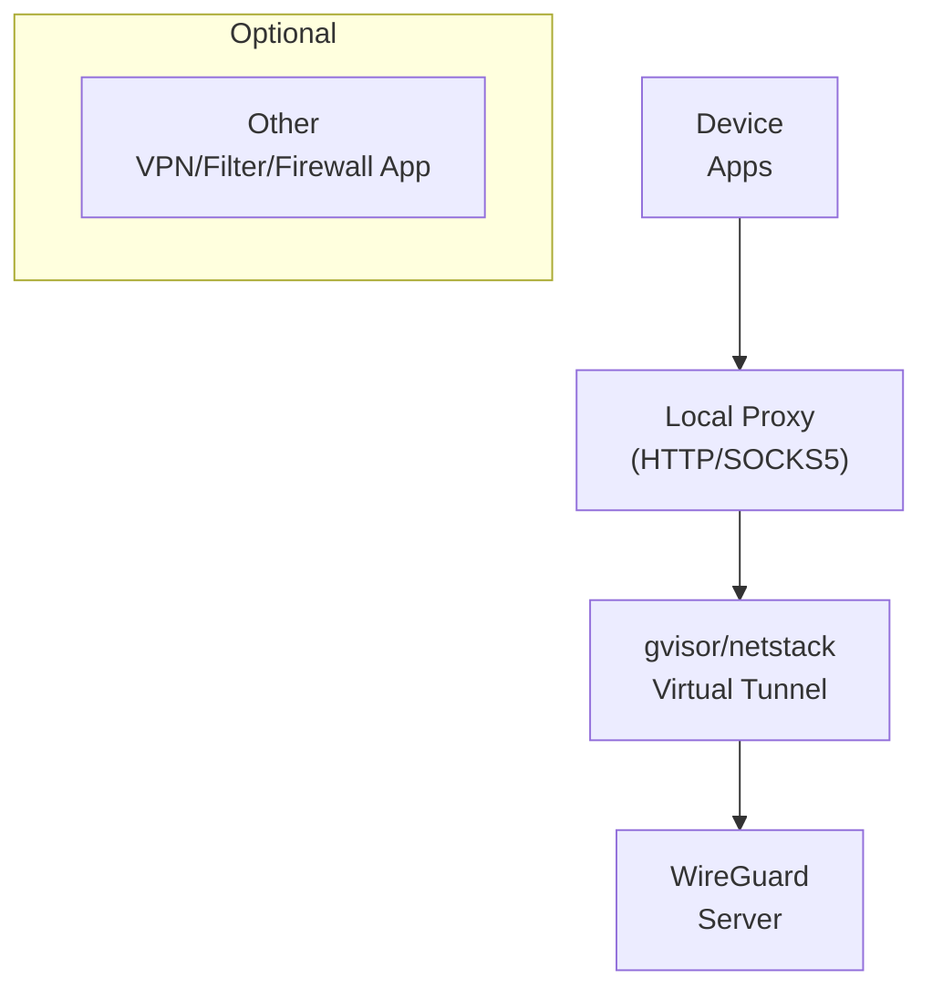
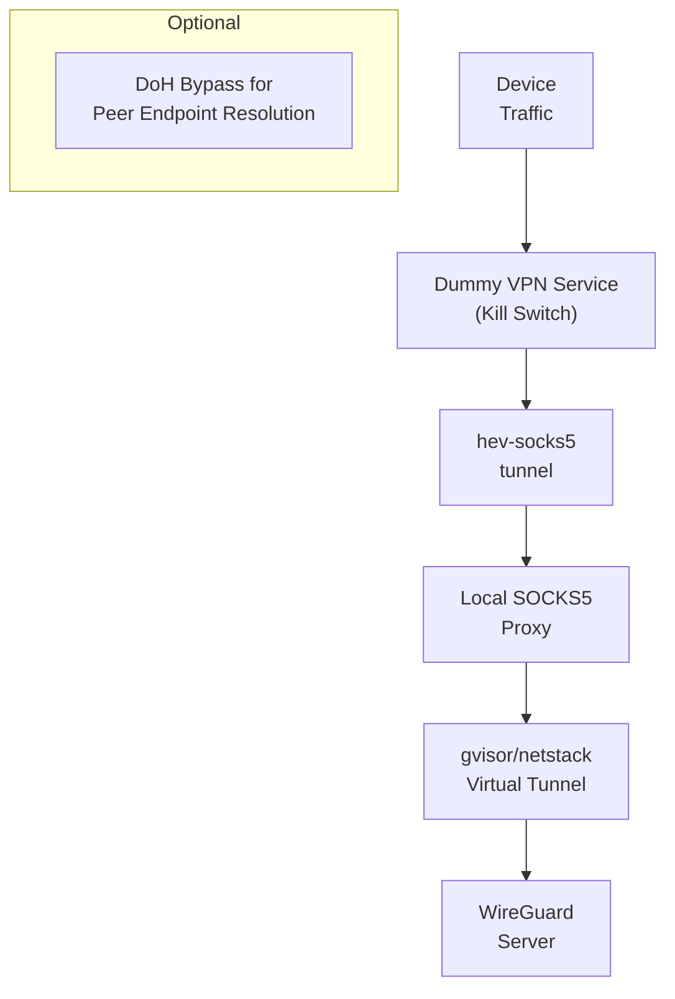

import ClickToRevealImage from "../../src/components/buttons/ShowImageButton";import React, { useState } from 'react';
import intentTasker from './img/intent_tasker.png';

# Settings

The Settings screen provides app-wide configurations to customize WG Tunnel's behavior, from core tunneling modes to monitoring and integrations. Access it via the bottom navigation bar.

## Key Concepts

Before diving into the settings, here's a quick overview of important terms used throughout:

- **Userspace Mode**: Runs WireGuard/AmneziaWG in userspace (app-level) using Android's VPN Service. This is the standard for most modes but limits to one active tunnel at a time.
- **Kernel Mode**: Uses the device's kernel WireGuard module (requires root). This allows multiple tunnels simultaneously without relying on VPN Service, offering better performance but with root dependencies.

These distinctions affect compatibility, performance, and features like multi-tunneling.

## Tunnels

These settings control global tunneling behavior, including modes and overrides.

### App Mode

Choose the operational mode for WG Tunnel. Each mode suits different use cases:

- **VPN**: Standard Android VPN setup, similar to most VPN apps. It captures all device traffic (or split-tunneled apps) and routes it through the WireGuard tunnel using VPN Service. Ideal for full-device protection.
- **Proxy**: Uses a virtual tunnel exposed on either an HTTP proxy or a SOCKS5 proxy or both (local proxy servers). This mode doesn't claim the VPN Service, allowing other apps (e.g., AdGuard for ad-blocking/firewalling) to own it while forwarding traffic to WG Tunnel's virtual tunnel via the local proxy. Alternatively, run another VPN app and configure proxy-supporting apps (like browsers) to route through WG Tunnel. Use case: Layered security or selective proxying without conflicting VPN services.



- **Lockdown**: This feature instantly activates and maintains a dummy VPN service that captures all device traffic at all times, functioning as a robust kill switch. It routes the captured traffic through hev-socks5-tunnel to a local SOCKS5 proxy, which then forwards it to our WireGuard gvisor/netstack virtual tunnel. This setup guarantees no traffic leaks outside the tunnel. Unlike Android's native always-on VPN kill switch, Lockdown supports optional bypassing of LAN traffic (configurable below). For resolving peer endpoints, it selectively bypasses a socket for DoH queries—using Cloudflare or AdGuard as set in DNS Settings—when necessary, enhancing overall privacy.


- **Kernel**: Leverages the device's kernel WireGuard module (root and supported Kernel required). No VPN Service needed, enabling multiple tunnels by default. Best for performance and multi-tunnel setups on rooted devices, but can have reliability drawbacks and supports less app features.

> Note: Proxy and Lockdown modes may also support multi-tunneling in future updates, as they use virtual tunnels.

### DNS Settings

Configure DNS resolution for peer endpoints (e.g., resolving "my-server.com" in configs). Options:

- **System DNS**: Use Android's default DNS resolver.
- **DoH (DNS over HTTPS)**: Secure alternative for privacy. Supported providers: Cloudflare (default) or AdGuard.

> **Note:** This feature currently applies only to peer endpoint resolutions, not all DNS traffic through the tunnel. The tunnel uses plaintext DNS servers from your .conf file.

### Proxy Settings (Proxy Mode Only)

When in Proxy mode, configure the local proxy servers:

- Enable/disable HTTP or SOCKS5 proxies.
- Set custom ports and authentication.

This allows fine-tuned integration with other apps.

### Allow LAN Traffic (Lockdown Mode Only)

When enabled, bypasses local LAN traffic (e.g., 192.168.0.0/16) from the kill switch, allowing access to local devices while blocking external leaks.

### Global Overrides

Enable this to apply universal settings to all tunnels without editing individual .conf files. Click in to configure:

- Global split tunneling (included/excluded apps).
- Peer DNS, MTU, AmneziaWG parameters, or scripts (as described in the Tunnels section).

Overrides ignore matching properties in .conf files for convenience.

### Android Integrations

Integrate WG Tunnel with Android features for seamless control.

- **Always-On VPN Link**: Directs to Android's system settings to enable the native always-on VPN kill switch.
- **Always-On VPN Control**: When enabled, allows Android's always-on VPN to automatically start/stop tunnels. Disabled by default to avoid conflicts with auto-tunneling.
- **Start on Boot**: Automatically activates your default tunnel when the device boots.
- **App Shortcuts**: Enable dynamic Android shortcuts for quick actions like toggling auto-tunneling or the default tunnel from your home screen.
- **Remote App Control**: When enabled, generates a secure key (copyable) for controlling WG Tunnel via intents from apps like Tasker or MacroDroid. See the Integrations section below for details.

#### Integrations

##### Remote App Control with Intents

WG Tunnel enables other apps (like Tasker, MacroDroid, etc.) to control toggling tunnels and auto-tunneling via intents.

Available actions:
- VPN on by tunnel name
- VPN off by tunnel name
- Start auto-tunnel
- Stop auto-tunnel

> **Note:** For security, this feature must be enabled in settings, generating a key for intent validation. Copy the key from the app.

Example request to start a tunnel:
```shell
am broadcast \                                               
    -a com.zaneschepke.wireguardautotunnel.START_TUNNEL \
    -n com.zaneschepke.wireguardautotunnel/com.zaneschepke.wireguardautotunnel.core.broadcast.RemoteControlReceiver \
    --es key "<your-key>" --es tunnelName "<tun-name>"
```
Example request to start auto-tunnel:
```shell
am broadcast \                                               
    -a com.zaneschepke.wireguardautotunnel.START_AUTO_TUNNEL \
    -n com.zaneschepke.wireguardautotunnel/com.zaneschepke.wireguardautotunnel.core.broadcast.RemoteControlReceiver \
    --es key "<your-key>"
```

List of all possible actions:
- `com.zaneschepke.wireguardautotunnel.START_TUNNEL`
- `com.zaneschepke.wireguardautotunnel.STOP_TUNNEL`
- `com.zaneschepke.wireguardautotunnel.START_AUTO_TUNNEL`
- `com.zaneschepke.wireguardautotunnel.STOP_AUTO_TUNNEL`

Component (important for security):
- `com.zaneschepke.wireguardautotunnel/com.zaneschepke.wireguardautotunnel.core.broadcast.RemoteControlReceiver`

> **Note:** If using a nightly or prerelease version, check the installed package name to adapt the first half of the component path.

Extras:
- `key`: Required for all requests; generated by the app.
- `tunnelName`: Required for start/stop tunnel actions; defaults to primary/first tunnel if omitted.

Example in [Tasker](https://tasker.joaoapps.com/):

<ClickToRevealImage
    src={intentTasker}
    alt="Intent Configured in Tasker"
    width="60%"
    showButtonText="Show Screenshot"
    hideButtonText="Hide Screenshot"
/>

## Monitoring

Monitor tunnel health and logs for troubleshooting. Tunnel health is shown on the main Tunnels screen via a green (healthy), red (unhealthy), or gray (unknown/stale) LED indicator. Health is determined hierarchically:

1. **Logs Check**: Takes precedence. If logs indicate issues (e.g., handshake/UDP failures) within the last 2 minutes, marked unhealthy.
2. **Ping Check**: If logs are healthy or absent, checks ping reachability. Unreachable targets mark unhealthy.
3. **Stats Check**: If no logs/pings, uses transfer stats. Zero RX bytes = unknown; stale (no recent activity) = stale; otherwise healthy.

### Ping Monitor (Disabled for Proxy and Lockdown)

When enabled, periodically pings targets to assess tunnel health. Click in to configure:

- **Tunnel Ping Interval**: Time between checks (default: 30 seconds).
- **Ping Attempts per Interval**: Pings per check (default: 3).
- **Tunnel Ping Timeout**: Custom timeout (defaults to attempts * 2000ms).
- **Display Detailed Ping Stats**: Shows latency, jitter, packets sent/lost, and last successful ping on the main Tunnels UI.
- **Custom Ping Targets**: Map targets per tunnel (defaults to Cloudflare for full tunnels, first internal IP for split tunnels).

Disabled in Proxy/Lockdown as they use virtual tunnels without direct ping support.

### Local Logs Monitor

When enabled, monitors app logs for health (e.g., detecting handshake/UDP issues). Click in to view live logs; top navigation drawer allows clearing or exporting logs.

## General

App-level preferences for usability and security.

### Appearance

Customize the app's look and feel:

- **Locale**: Select in-app language via a selector screen.
- **Notifications Link**: Directs to system settings to enable app notifications. Active tunnels/auto-tunneling show notifications with stop actions.
- **Theme**: Choose light, dark, or system-default theme.

### App Lock

Set an in-app PIN to secure the UI. Required on app open for added privacy.

### Backup and Restore

Opens a drawer to backup or restore the app database (tunnels, settings). Only available when auto-tunneling and all tunnels are inactive.